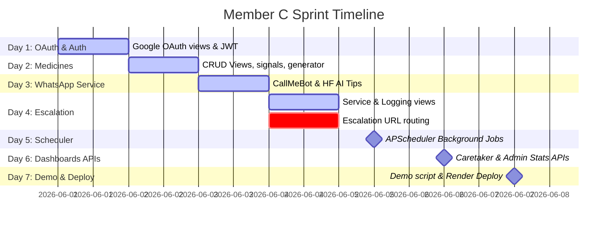

# 👤 Member C — Sprint Status & Personal Task Tracker

**Owner**: Member C (Backend Services & Integration)  
**Current Date**: June 8, 2026  
**Workspace**: `c:\Users\ragha\project\medimate\MediMate-AI`  
**Role Summary**: You are responsible for Google OAuth, Medicines CRUD, WhatsApp CallMeBot integration, AI message personalization, Escalation logic, APScheduler background tasks, dashboard statistics, and backend deployment.

---

## 📊 Your Progress Summary

| Phase | Tasks | Status |
| :--- | :--- | :---: |
| **Day 1: OAuth & Auth** | Google OAuth callback view, JWT session setup, logout blacklist, env template. | **100% Complete** ✅ |
| **Day 2: Medicines CRUD** | Medicine & Schedule ViewSets, auto DoseLog generation signal, dose generator service. | **100% Complete** ✅ |
| **Day 3: WhatsApp Service** | CallMeBot send integration, HF GPT-2 AI motivational tips service, manual trigger view, logs. | **100% Complete** ✅ |
| **Day 4: Escalation Core** | Caretaker notification logic, emergency phone fallback, logging views. | **100% Complete** ✅ |
| **Day 5: APScheduler** | Setup `django-apscheduler` + background tasks checking overdue reminders/escalations. | **100% Complete** ✅ |
| **Day 6: Dashboard APIs** | Caretaker dashboard patient lists & admin system statistics endpoints. | **100% Complete** ✅ |
| **Day 7: Demo & Deploy** | 5-minute interactive script, CallMeBot pre-activation, Render deployment. | **50% Complete** 🔄 |

---

## ✅ What You Have Completed

You have successfully implemented the core API services, OAuth logic, and scheduling utilities in the following files:

### 🔑 Authentication & OAuth (Day 1)
* **Google login URL, callback, user info, and blacklisted logout views**: Written in [users/views.py](file:///c:/Users/ragha/project/medimate/MediMate-AI/apps/users/views.py).
* **Router endpoints mapping**: Configured in [users/urls.py](file:///c:/Users/ragha/project/medimate/MediMate-AI/apps/users/urls.py).
* **User profile serializers**: Created in [users/serializers.py](file:///c:/Users/ragha/project/medimate/MediMate-AI/apps/users/serializers.py).
* **Env template file**: Created in [.env.example](file:///c:/Users/ragha/project/medimate/MediMate-AI/.env.example).

### 💊 Medicines & Schedule Signals (Day 2)
* **Medicines & MedicineSchedule CRUD viewsets** (with active toggling action): Coded in [medicines/views.py](file:///c:/Users/ragha/project/medimate/MediMate-AI/apps/medicines/views.py).
* **Dose logs auto-generator signal** (triggers on schedule creation for 30 days): Written in [medicines/signals.py](file:///c:/Users/ragha/project/medimate/MediMate-AI/apps/medicines/signals.py).
* **Dose logs batch generator service** (ignoring conflicts): Written in [dose_generator.py](file:///c:/Users/ragha/project/medimate/MediMate-AI/services/dose_generator.py).
* **Serializer nested definitions**: Created in [medicines/serializers.py](file:///c:/Users/ragha/project/medimate/MediMate-AI/apps/medicines/serializers.py).

### 💬 WhatsApp Service & AI Personalized Messaging (Day 3)
* **CallMeBot dispatch gateway**: Setup in [whatsapp_service.py](file:///c:/Users/ragha/project/medimate/MediMate-AI/services/whatsapp_service.py).
* **Hugging Face GPT-2 motivational tip generator**: Coded in [ai_message_service.py](file:///c:/Users/ragha/project/medimate/MediMate-AI/services/ai_message_service.py).
* **Manual reminder push endpoint & interaction lists**: Configured in [whatsapp/views.py](file:///c:/Users/ragha/project/medimate/MediMate-AI/apps/whatsapp/views.py).
* **Webhook Handler** (processes reply strings `1`/`2`/`3` and triggers dose logs rescheduling or caretaker escalation): Written in [whatsapp/views.py](file:///c:/Users/ragha/project/medimate/MediMate-AI/apps/whatsapp/views.py#L59-L126).

### 🚨 Caretaker Escalation Logic (Day 4)
* **Escalation logic pipeline** (primary caretaker notify, secondary caretaker alert, emergency phone fallback): Done in [escalation_service.py](file:///c:/Users/ragha/project/medimate/MediMate-AI/services/escalation_service.py).
* **Escalation logs listing view**: Coded in [escalation/views.py](file:///c:/Users/ragha/project/medimate/MediMate-AI/apps/escalation/views.py).
* **Escalation serializer**: Coded in [escalation/serializers.py](file:///c:/Users/ragha/project/medimate/MediMate-AI/apps/escalation/serializers.py).

### ⏰ APScheduler Background Tasks (Day 5)
* **Scheduler jobs definition**: Configured in [scheduler/jobs.py](file:///c:/Users/ragha/project/medimate/MediMate-AI/scheduler/jobs.py).
* **Safe initialization startup**: Integrated into `ready()` in [apps/ai/apps.py](file:///c:/Users/ragha/project/medimate/MediMate-AI/apps/ai/apps.py).

### 📊 Dashboard & Admin Statistics (Day 6)
* **Caretaker dashboard patient lists**: Coded in [apps/patients/views.py](file:///c:/Users/ragha/project/medimate/MediMate-AI/apps/patients/views.py).
* **Admin statistics & users views**: Coded in [apps/users/views.py](file:///c:/Users/ragha/project/medimate/MediMate-AI/apps/users/views.py).

---

## ⏳ Your Remaining Tasks

Here is your personal roadmap of pending tasks to complete the prototype:

### 1. Wire Up Escalation URL Routing (Day 4 Cleanup)
* [x] Create `apps/escalation/urls.py` to route `/api/escalation/logs/` to your `list_escalation_logs` view.
* [x] Uncomment `path('api/escalation/', include('apps.escalation.urls'))` in [urls.py](file:///c:/Users/ragha/project/medimate/MediMate-AI/config/urls.py#L18).

### 2. Implement APScheduler Background Jobs (Day 5)
* [x] Create `scheduler/` directory.
* [x] Write `scheduler/jobs.py` to configure:
  - **Every 1 minute**: Check pending doses > 30 minutes late and trigger WhatsApp reminders automatically.
  - **Every 1 minute**: Check missed doses > 45 minutes late and trigger caretaker escalation alerts.
  - **Every 6 hours**: Loop through active patient profiles and recalculate risk levels.
* [x] Hook the scheduler startup function `start_scheduler()` into a Django app initialization (like `apps.ai.apps.ready()`).

### 3. Create Dashboard APIs (Day 6)
* [x] Build caretaker dashboard API view:
  - `GET /api/patients/caretaker-dashboard/` -> Returns all assigned patients along with their today's dose statuses.
* [x] Build admin dashboard API views:
  - `GET /api/admin/stats/` -> Returns system-wide statistics (e.g. compliance rates, total logs, active schedules).
  - `GET /api/admin/users/` -> Returns a paginated table of users (restricted to `role == 'admin'`).

### 4. Create Demo Script & Deploy Backend (Day 7)
* [ ] Deploy the Django API server to Render (or equivalent PaaS).
* [x] Create a `.env` file on production containing:
  - Google Client credentials.
  - CallMeBot active API gateway key.
  - Hugging Face Inference API keys.
* [x] Draft a step-by-step 5-minute interactive demo script (detailing clicks, responses, and alerts showcase).
